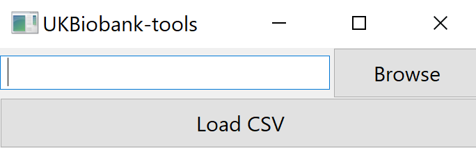
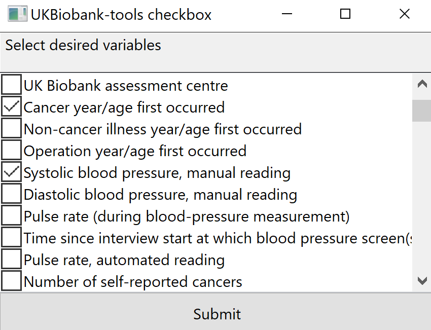
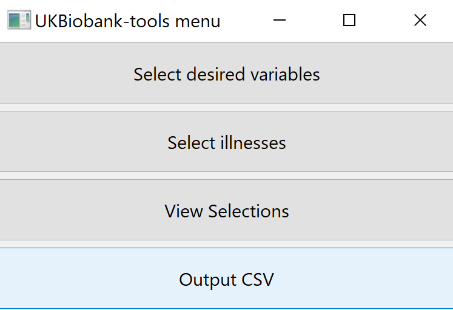
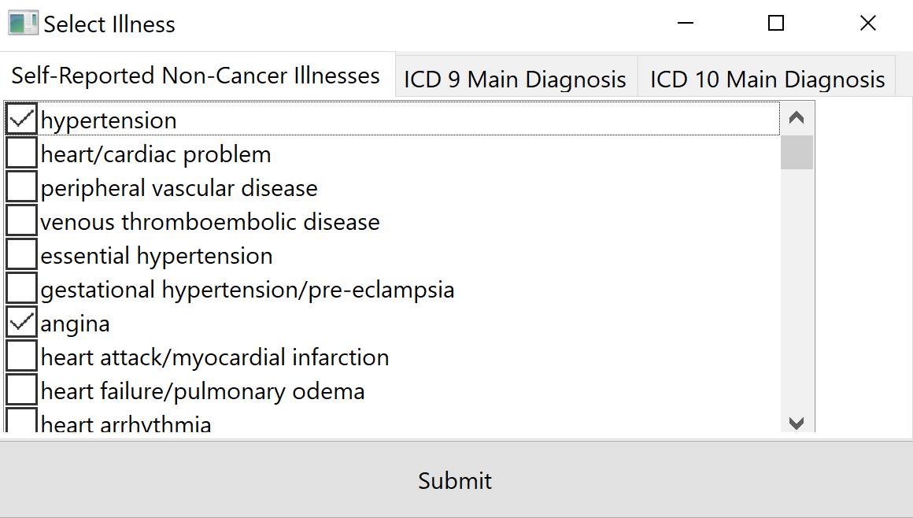
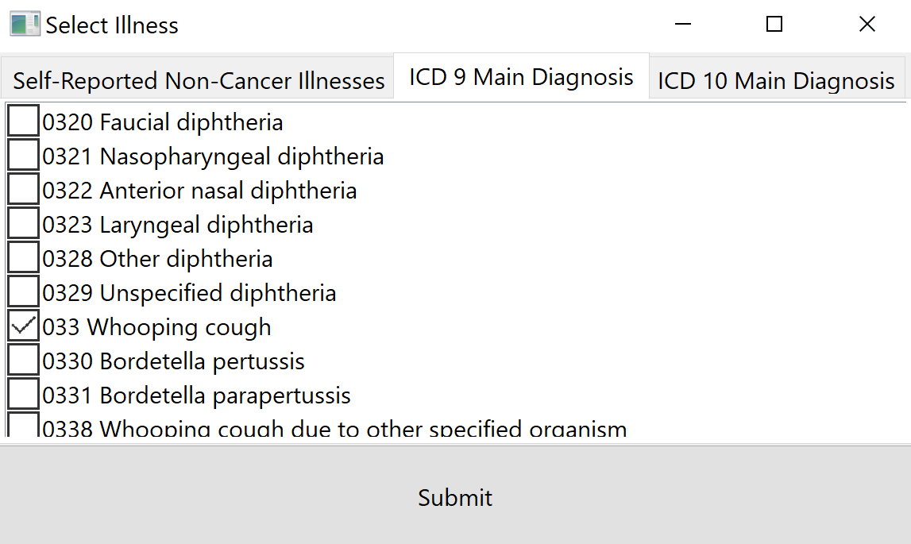

.. _examples:

********
Examples
********

UKBiobank-tools contains both a graphical user interface (GUI) and command line interface (CLI). Examples listed below will demonstrate how the same tasks may be achieved through using the GUI and CLI.

.. Note:: Any data presented during examples has been randomised and do not represent actual UK Biobank data.

.. Note:: Certain functionality is currently only available via the command line interface. Such examples are planned to be released as part of the GUI in future versions.

.. contents:: Table of Contents

.. _load_ukbiobank_object_label:

Getting started - loading the ukbiobank object
==============================================

In order to begin using ukbiobank-tools, first UKBiobank data in csv format must be loaded.

GUI
---

1. Open GUI

.. code-block:: python

  # Import ukbiobank GUI module
  import ukbiobank.gui

  # Open GUI
  ukbiobank.gui.open()

2. Load UK Biobank *csv* file

   UKBiobank-tools loading screen.

CLI
---

.. code-block:: python

  # Import ukbiobank module
  import ukbiobank

  # Path to ukb csv file
  csv_path = 'path/to/ukbiobank_csv_file.csv' # (this can also accept zipped csv files, e.g. path/to/ukbiobank_csv_file.zip 

  # Load 'ukbio' object
  ukb = ukbiobank.ukbio(ukb_csv=csv_path)

.. _select_variables_label:

Selecting a subset of ukbiobank field variables
===============================================

Sometimes we may wish to filter sub-select only a few variables for analysis. UKBiobank-tools makes it easy to filter large UK Biobank *.csv* files down to smaller files containing only variables of interest.

GUI
---

1. Load ukbiobank object (see :any:`above <load_ukbiobank_object_label>`)

2. Select 'select variables' option and select desired variables.

   UKBiobank-tools select variables screen.

3. Select 'output csv' to save *.csv* file

   UKBiobank-tools select output csv.

CLI
---

.. sidebar:: Note

    - addFields accepts both field IDs (e.g. 31), variable names  (e.g. 'Sex') or even a list of mixed (e.g. ['Sex', 20002, 'Waist circumference']).

.. code-block:: python

  # Load 'ukbio' object
  ukb = ukbiobank.ukbio(ukb_csv=csv_path)

  # Select desired fields 
  fields = ['Sex', 'Year of birth (Field ID: 34)', 'Number of treatments/medications taken']

  # Import addFields function
  from ukbiobank.utils.utils import addFields

  # Load selected fields into dataframe
  df = addFields(ukbio=ukb, fields=fields)

Certain ukbiobank fields are encoded using the same field name, for example 'Year of birth' may point towards Field ID 31 (collected during the assessment centre) or Field ID 22200 (collected during online follow up). In this case there are two ways in which to distinguish between these variables when using *addFields*:

* Use the specific Field ID(s)

.. code-block:: python

    df = addFields(ukbio=ukb, fields=[31])

* Use the field name followed by '(Field ID: XX)'

.. code-block:: python

    df = addFields(ukbio=ukb, fields=['Year of birth (Field ID: 31)'])

This method can be useful for keeping track of variables without having to remember their specific IDs. A list of all available field IDs can be requested after loading the ukbiobank object via the following command:

.. code-block:: python

    fieldnames = ukb.field_instance_array_df.field_name.unique().tolist()

Fields can also be added to an existing dataframe by including the **df** input parameter:

.. code-block:: python

    new_df = addFields(ukbio=ukb, df=df, fields=['Number of jobs held'])

See the :py:func:`addFields <ukbiobank.utils.utils.addFields>` function for further functionality.

Selecting a subset of individuals based upon illness
====================================================

UKBiobank-tools can be used to filter ukbiobank data based upon illness diagnosis. Diagnoses may be self-reported, or through cross-referenced hospital records based on ICD-9 or ICD-10 diagnostic categories.

GUI
---

1. Load ukbiobank object (see :any:`above <load_ukbiobank_object_label>`)

2. Select 'select illnesses' option and select desired illnesses.

   UKBiobank-tools select illness based upon self-reported diaagnosis.

   UKBiobank-tools select illness based upon cross-referenced ICD-9 diagnosis.

3. Select 'output csv' to save *.csv* file

CLI
---

Filtering based upon specific illnesses can be achieved using the :py:func:`filterByField <ukbiobank.filtering.filtering.filterByField>` function:

.. code-block:: python

 # Load 'ukbio' object
 ukb = ukbiobank.ukbio(ukb_csv=csv_path)

 # Selecting self-reported illness as desired field  
 self_reported_illness_field = 20002
 illness = 1263 # 1263 corresponds to 'dementia/alzheimers/cognitive impairment'

 # Organise field and illness into dictionary
 fields_to_include = {self_reported_illness_field: illness}
 
 # Import filterByField
 from ukbiobank.filtering.filtering import filterByField

 dementia_df = filterByField(ukbio=ukb, fields_to_include=fields_to_include)